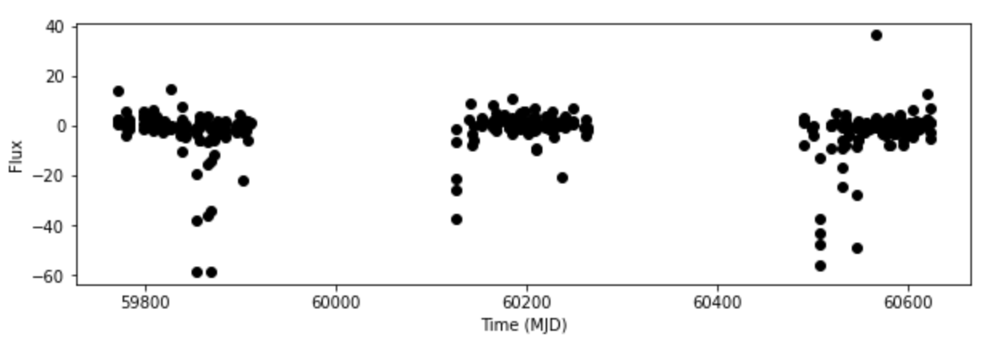
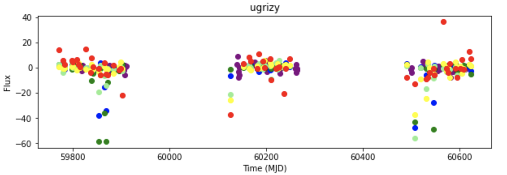

# Siddharth Patel - Week of 07/23/2021 - Report 6

## 1. Work done

### 1.1 Papers Read

**Lobbying for the ear : the public fascination with andacademic legitimacy of the sonification of scientific data** [[Link](https://cris.maastrichtuniversity.nl/ws/portalfiles/portal/706794/guid-f9e34ec6-b0f4-4618-9d2b-cbf321bebc6e-ASSET1.0.pdf)]: Read chapter 4. This chapter discussed the thought process of mapping data to sound as what scientists think of sonification. The process of figuring out how to map data to sound is about objectivity vs subjectivity. Objectivity being staying true to the data and subjectivity being how we can tune parameters to make the overall sound more interpretable. One example is that for a blind audience, if you dropped a coin it would be a high pitch but a roll of coins would be a low pitch. But for a sighted audience as the value of money increases the pitch increases. So there is the thought of subjectivity here. Scientists from interviews in the chapters all generally said that sonification is currently a gimmick and is used to grab an aduience's attention. But one point raised by the author to this is that maybe to appreciate sonification, audiences may need a trained ear as people have a trained eye for visual graphs.

### 1.2 Code Written

I wrote two notebooks this week. The first was sonifying and plotting supernova type Ibc. And the second was the presentation notebook which cleaned up code from the first notebook and also plotted and sonifed eclipsing binary stars as well as supernova type Ibc

First notebook (Supernova type Ibc): [[GitHub Link](https://github.com/fedhere/RubinRhapsodies/blob/main/SNIBCsonify.ipynb)]

Second notebook (Presentation: July 22nd): [[GitHub Link](https://github.com/fedhere/RubinRhapsodies/blob/main/july22pres.ipynb)]

## 2. Figures (at least 1 figure)

Here are some plots from the presentation this week, they are included in the notebooks above as well as their corresponding sonifications:

|Figure 1 | Plot of an eclipsing binary (Object 7566)|
| :------------------: |
||

|Figure 2 | Plot of an eclipsing binary w/ passband distinction (Object 7566)|
| :------------------: |
||

## 3. Results

Overall good week, learned a bit more about how to work with the sonify code. After the meeting with Bea, we got some really good ideas on how we can move forward. As suggested by Bea, we can map flux error to volume which is the next step, but should also look at the new sonification resources she pointed out aswell to incorporate this.

## 4. Planning

Take a look at the resources Bea suggested and see if we can use those instead of the sonify code

Figure out and try to implement flux error to volume mapping with the sonify code.
