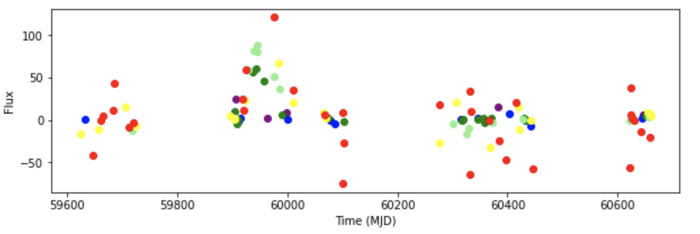

# Siddharth Patel - Week of 07/30/2021 - Report 7

## 1. Work done

### 1.1 Papers Read

**MIDIUtil and Seaborn** [[MIDIUtil](https://readthedocs.org/projects/midiutil/downloads/pdf/latest/)],[[Seaborn](https://seaborn.pydata.org/tutorial.html)]: Read MIDIUtil documentation to make sure I understand how core.py utilizes it to change things like pitch and volume, which helped me make my edits to core.py. Then for next week's work, I started reading the Seaborn documentation to figure out how to get better colors in the plots in general and for the presentation on August 10th.

### 1.2 Code Written

This week, I edited core.py to map flux error to volume, I also created a notebook volMap.ipynb to hear the difference in sound.

volMap.ipynb (Supernova type Ibc): [[GitHub Link](https://github.com/fedhere/RubinRhapsodies/blob/main/volMap.ipynb)]

## 2. Figures (at least 1 figure)

This week, the main goal was the flux error - volume mapping, so the notebook above has the sonifications. 
In that notebook, one of the supernovae (object: 5515915) had a more audible change in volume based on its higher flux errors, so here is a figure of this object.

|Figure 1 : Plot of a supernovae with generally higher flux errors (Object 5515915)|
| :----------------------------------------------------------: |
|  | 

## 3. Results

Main focus of this week was to figure out how to map flux error to volume. Mainly worked on editing core.py and debugging the changes in previous notebooks.

## 4. Planning

Write code to find the flux range for each band of objects: 615, 5515915, and 287556.

Fix up plot and their colors with Seaborn.

Make presentation slides for August 10th and prepare
