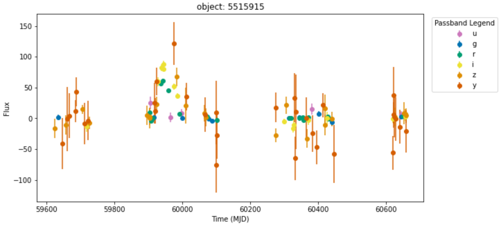
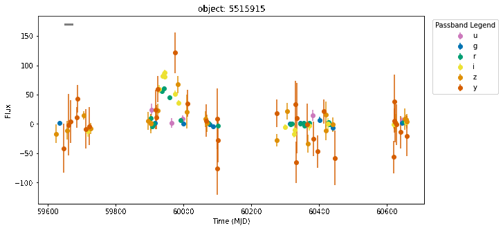

# Siddharth Patel - Week of 08/06/2021 - Report 8

## 1. Work done

### 1.1 Papers Read

**Seaborn and Imagemagick** [[Imagemagick](https://imagemagick.org/script/command-line-processing.php)],[[Seaborn](https://seaborn.pydata.org/tutorial.html)]: Read the documentation for both Seaborn and Imagemagick. Successfully figured out how to make plots with appropriate colors using Seaborn palletes and how to create gifs of my plots using Imagemagick.

### 1.3 Other

Created slides for the Research Bytes presentation on August 10th, included the plot gifs and sonifications.

## 2. Figures (at least 1 figure)

New color plot and gif of plot to sync to sonification: 

|Figure 1 : New color plot (Object 5515915)|
| :----------------------------------------------------------: |
|  | 

|Figure 2 : New color plot gif (Object 5515915)|
| :----------------------------------------------------------: |
|  | 

## 3. Results

Main focus of this week was to fix up plots, change colors/error bars, then turn plots into gifs that I can sync to the sonifications. And use both of these in the presentation next week.

## 4. Planning

Work on presentation slides and script

Try change mapping of passbands to pitch and flux to volume
